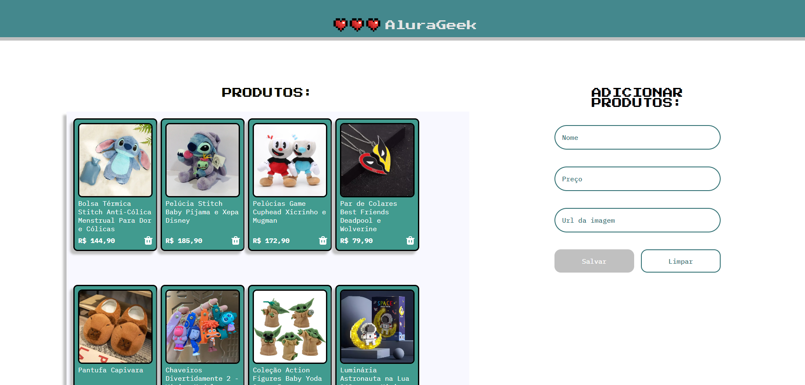

# AluraGeek

Este projeto faz parte do desafio "Praticando Front End" da Alura, onde desenvolvemos uma aplicação para listar, cadastrar e deletar produtos utilizando HTML, CSS e JavaScript.



## Funcionalidades

- **Listagem de Produtos:** Exibe todos os produtos cadastrados.
- **Adicionar Produtos:** Formulário para inserir novos produtos com validação de entrada.
- **Deletar Produtos:** Funcionalidade para remover produtos da lista.

## Estrutura do Projeto

```
├── css/
│   └── main.css
├── js/
│   ├── showProducts.js
│   ├── createProduct.js
│   ├── clearForm.js
│   ├── deleteProduct.js
│   └── validate.js
├── assets/
│   └── hearts.svg
├── img/
│   └── geek.png
├── index.html
└── README.md
```

## Como Usar

1. Clone este repositório.
2. Abra o arquivo `index.html` em seu navegador.

## Contribuição

Este é um projeto educacional desenvolvido como parte do curso da Alura. Contribuições não são esperadas.

---